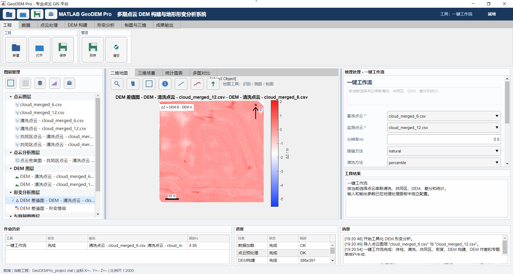
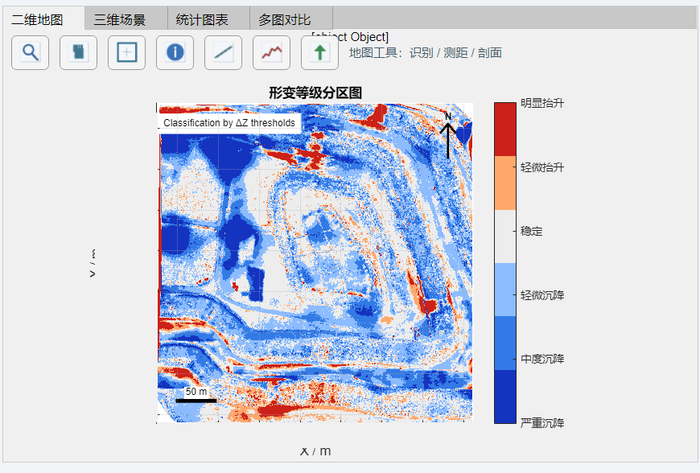
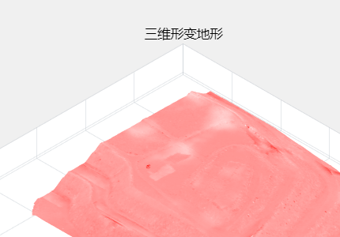
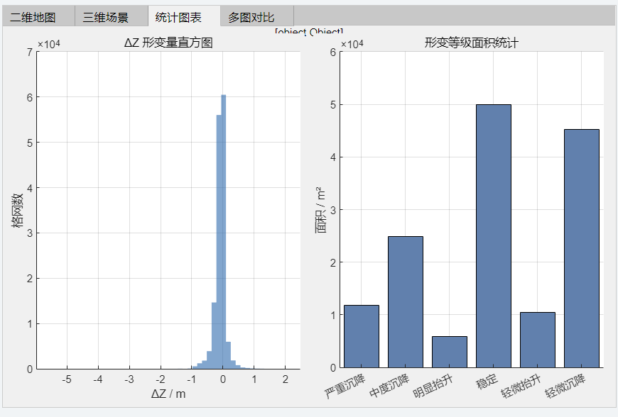
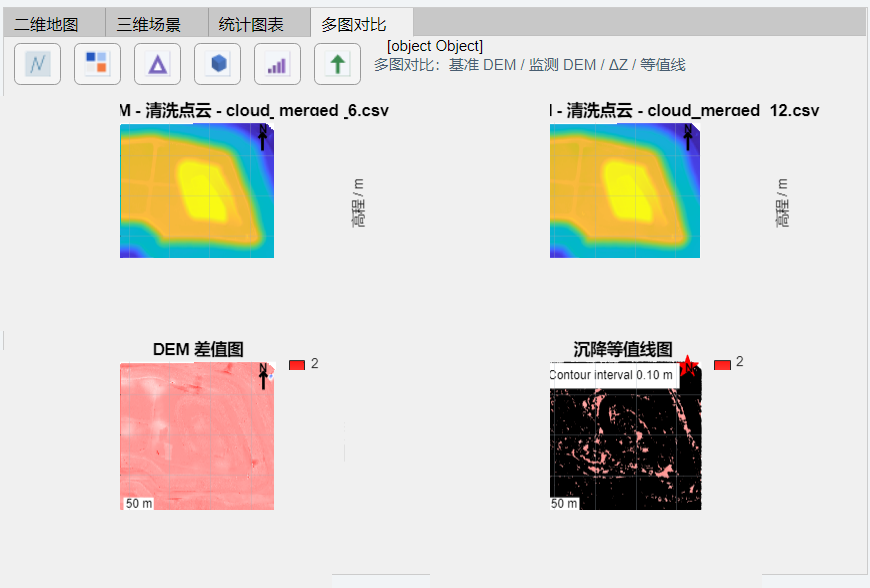

# GeoDEM Pro

GeoDEM Pro 是一个基于 MATLAB 的桌面 GIS 原型系统，面向多时相点云 DEM 构建与地形形变分析。项目围绕“点云输入 - DEM 建模 - 多期差分 - 形变统计 - GIS 可视化 - 成果导出”组织，提供从数据处理到结果表达的完整工作流。



## 界面预览

| 二维形变分级 | 三维形变地形 |
| --- | --- |
|  |  |

| 统计图表 | 多图对比 |
| --- | --- |
|  |  |

## 功能概览

- CSV/TXT 点云导入；
- 点云质量检查与异常值清洗；
- 两期点云共同覆盖区提取；
- DEM 栅格构建；
- DEM 作差与形变统计；
- 沉降、隆起、稳定区分类；
- 二维地图、三维场景、统计图表和多图对比视图；
- 图层管理、属性表、测距、剖面分析等 GIS 式操作；
- PNG/PDF 图件、CSV/MAT 数据、GeoTIFF、Shapefile、工程文件、HTML/DOCX 报告导出。

## 环境要求

- MATLAB R2019b 或更高版本。
- 推荐安装 Mapping Toolbox，用于 GeoTIFF、Shapefile 等 GIS 数据读写。
- LAS/LAZ 点云导入依赖较新 MATLAB 版本中的 `lasFileReader` 以及 Lidar Toolbox；在 R2019b 环境下建议使用 CSV/TXT 点云。

项目代码避免使用 MATLAB R2019b 不支持的 `arguments` 语法，并通过 `+geodem/+compat` 提供部分版本兼容封装。

## 快速启动

在 MATLAB 中切换到仓库根目录，然后运行：

```matlab
cd('path/to/GeoDEM-Pro')
runGeoDEMPro
```

`runGeoDEMPro.m` 会自动将仓库根目录加入 MATLAB path，并启动 GeoDEM Pro 应用。

## 项目结构

```text
GeoDEM-Pro/
├── runGeoDEMPro.m
├── +geodem/
│   ├── +app/
│   ├── +controller/
│   ├── +model/
│   ├── +service/
│   ├── +tool/
│   ├── +view/
│   ├── +compat/
│   └── +util/
├── assets/
│   ├── icons/
│   └── screenshots/
├── tests/
├── testdata/
├── README.md
└── LICENSE
```

主要目录说明：

- `runGeoDEMPro.m`：软件启动入口。
- `+geodem/+app`：应用 facade，负责组装整体软件对象。
- `+geodem/+controller`：用户操作、工具执行、图层交互和工程动作调度。
- `+geodem/+model`：点云、DEM、形变结果、图层、工程状态和视图状态模型。
- `+geodem/+service`：点云处理、DEM 构建、形变分析、成果导出、报告生成等核心服务。
- `+geodem/+tool`：工具注册表、工具参数、执行上下文和插件式工具定义。
- `+geodem/+view`：MATLAB `uifigure` 主界面、Ribbon、图层树、地理处理面板和状态栏。
- `+geodem/+view/+renderer`：二维地图、三维场景、图表、多图对比和剖面渲染器。
- `+geodem/+compat`：MATLAB 版本兼容层。
- `assets/icons`：界面图标资源。
- `assets/screenshots`：README 使用的实际软件界面截图。
- `testdata`：脱敏后的示例点云数据。
- `tests`：测试脚本和 UI 冒烟测试脚本。

## 推荐使用流程

1. 在 `数据 > 导入 > 点云` 中导入两个 CSV/TXT 点云图层。
2. 根据需要运行点云清洗、密度分析、共同覆盖区提取、DEM 构建等工具。
3. 在右侧 `Geoprocessing` 面板中配置输入图层、分辨率、插值方法和阈值参数。
4. 运行 DEM 作差或一键分析工作流。
5. 在 Map、Scene、Charts、Compare 视图中查看结果。
6. 导出图件、表格、GeoTIFF、Shapefile、工程文件或分析报告。

默认差分方向为：

```text
Delta Z = DEM_monitor - DEM_base
```

当 `Delta Z < 0` 时表示监测期高程低于基准期，可解释为沉降；当 `Delta Z > 0` 时表示高程抬升。

## 示例数据

`testdata/` 目录中提供两期示例点云：

- `cloud_merged_6.csv`
- `cloud_merged_12.csv`

同时提供对应 TXT 文件，用于测试 TXT 导入兼容性。

公开版本中的样例点云已经做过平移脱敏处理，坐标被转换到局部匿名坐标系。点间相对距离、覆盖形状和两期间形变差值保持不变，但绝对地理位置和绝对高程不再代表真实坐标。

这些数据仅用于软件演示和测试。真实工程或科研分析请替换为自有点云数据，并确认坐标系统、采集方式、精度和使用许可。

## 运行测试

在 MATLAB 中进入仓库根目录后运行：

```matlab
addpath(genpath(pwd))
run('tests/runAllTests.m')
```

如需运行 UI 相关冒烟测试：

```matlab
run('tests/runUiImportTest.m')
run('tests/runUiSmokeTest.m')
```

测试输出默认写入 `output/test_run/`。该目录已被 `.gitignore` 忽略，不会进入版本库。

## 许可证

本项目使用 MIT License，详见 [LICENSE](LICENSE)。
